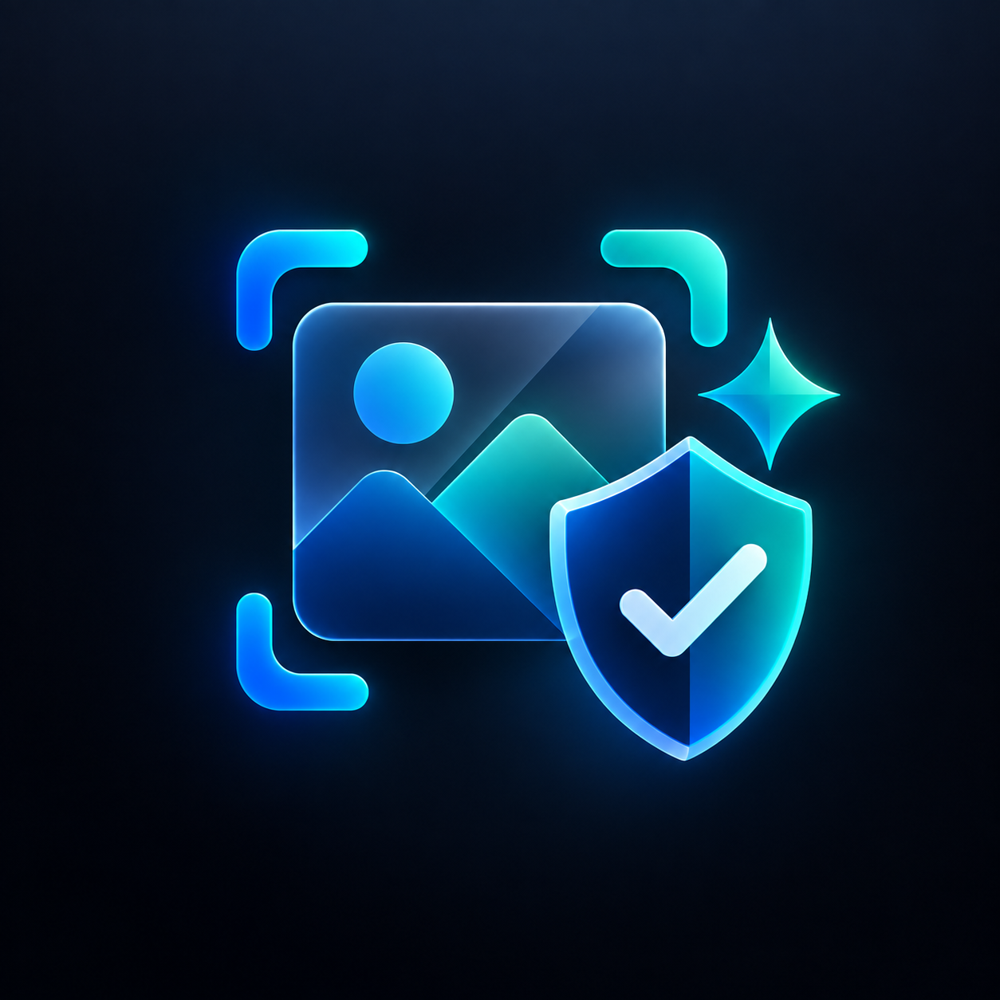

<p align="center">
  
</p>

<p align="center">
  <b>Image Quality Guard</b><br>
  Detect blurry, poorly lit, and low-contrast images before they enter your upload, scanning, or recognition workflow.
</p>

<p align="center">
  <a href="https://pub.dev/packages/image_quality_guard">
    
  </a>
  <a href="https://github.com/Tanvirul-swe/image_quality_guard">
    
  </a>
  <a href="https://Tanvirul-swe.github.io/image_quality_guard/">
    
  </a>
  
  
</p>

---

## 🎯 What is Image Quality Guard?

`image_quality_guard` is a platform-independent Dart package for **Flutter** and **Dart** applications. It analyzes image bytes to detect quality issues — blur, brightness, and contrast — before images enter your upload, scanning, or recognition pipeline.

**No native runtime dependencies.** Analysis runs entirely in Dart, with optional background isolate support for smooth UI performance.

### 🔑 Key Capabilities

| Capability | Description |
|---|---|
| 🔍 **Blur Detection** | Laplacian variance analysis to flag out-of-focus images |
| 💡 **Brightness Analysis** | Classifies images as too dark, optimal, or too bright |
| 🎨 **Contrast Measurement** | luminance standard deviation for depth and clarity |
| ✅ **One-Call Validation** | Combined pass/fail with a single `validate()` call |
| ⚙️ **5 Presets** | Card, document, photo, relaxed, and strict configurations |
| 🎛️ **Custom Thresholds** | Fine-tune every metric for your specific use case |
| 🚀 **Background Isolate** | Non-blocking analysis for large images |
| 🌐 **Web Support** | Runs on Flutter web — desktop, mobile, and browser |
| 📦 **Encoded & Decoded Input** | Accept raw bytes or pre-decoded `image` package objects |

---

## 📦 Installation

```console
flutter pub add image_quality_guard
```

```dart
import 'package:image_quality_guard/image_quality_guard.dart';
```

---

## 🚀 Quick Start

### Main API: `ImageQualityGuard` (recommended)

Pass encoded image bytes from a camera, gallery picker, file, or network response. Analysis runs on a **background isolate** — your UI stays responsive:

```dart
import 'dart:typed_data';
import 'package:image_quality_guard/image_quality_guard.dart';

final result = await ImageQualityGuard.analyze(imageBytes);

if (result.isValid) {
  // ✅ Image quality is acceptable — proceed with upload or processing
} else {
  // ❌ Issues detected
  for (final issue in result.issues) {
    print(issue);
  }
}
```

> ⚠️ Invalid or unsupported image bytes throw an `ImageDecodeException`.

---

### Alternative API: `ImageQualityValidator`

A convenience wrapper that returns `QualityResult` with typed sub-results:

```dart
final validator = ImageQualityValidator();
final result = await validator.validate(imageBytes);

if (result.isValid) {
  // Proceed with the upload or recognition flow.
} else {
  print(result.errorMessage);
}
```

---

## 🏷️ Presets

Choose a preset matching your capture scenario:

```dart
final guard = ImageQualityGuard.analyze(
  imageBytes,
  config: ImageQualityConfig.documentScanning,
);
```

| Preset | Intended Use | Blur | Min Bright | Max Bright | Min Contrast |
|---|---|:---:|:---:|:---:|:---:|
| 🪪 `ImageQualityConfig.cardScanning` | IDs, bank cards, licenses | 80 | 35 | 230 | 40 |
| 📄 `ImageQualityConfig.documentScanning` | Forms, receipts, printed text | 120 | 45 | 215 | 55 |
| 📷 `ImageQualityConfig.photoCapture` | High-quality photo capture | 200 | 30 | 235 | 45 |
| 😊 `ImageQualityConfig.relaxed` | Challenging lighting / low-quality cameras | 50 | 25 | 240 | 30 |
| ✔️ `ImageQualityConfig.strict` | Strict quality requirements | 250 | 50 | 200 | 65 |
| 📱 `ImageQualityConfig.mobile` | Balanced defaults for mobile (no downsampling limit change) | 100 | 40 | 220 | 50 |

---

## 🎛️ Custom Thresholds

Override individual metrics for application-specific needs:

```dart
final guard = ImageQualityGuard.analyze(
  imageBytes,
  config: ImageQualityConfig(
    blurThreshold: 150,
    minBrightness: 50,
    maxBrightness: 210,
    minContrast: 60,
  ),
);
```

| Parameter | Description | Range | Default |
|---|---|:---:|:---:|
| `blurThreshold` | Higher = sharper image required | 1–∞ | 100.0 |
| `minBrightness` | Below = too dark (0–255 luminance) | 0–255 | 40.0 |
| `maxBrightness` | Above = too bright/overexposed (0–255) | 0–255 | 220.0 |
| `minContrast` | Higher = more luminance variation required | 0–∞ | 50.0 |
| `maxAnalysisDimension` | Longest side for analysis (px); `0` = full res | 0–∞ | 1280 |

> 💡 **Tip:** Quality thresholds are heuristics. Calibrate them with representative images from your target devices and environments.

---

## 🔎 Individual Checks

Run specific checks independently:

```dart
final validator = ImageQualityValidator();

// 🔍 Blur check
final blur = validator.checkBlur(imageBytes);
print('Variance: ${blur.variance}, Sharp: ${!blur.isBlurry}');

// 💡 Brightness check
final brightness = validator.checkBrightness(imageBytes);
print('Level: ${brightness.level}, Avg: ${brightness.averageBrightness}');

// 🎨 Contrast check
final contrast = validator.checkContrast(imageBytes);
print('Score: ${contrast.contrastScore}, Good: ${contrast.hasGoodContrast}');
```

For images already decoded with `package:image`, use the `*FromImage` variants to avoid re-decoding:

```dart
final blur = validator.checkBlurFromImage(decodedImage);
final brightness = validator.checkBrightnessFromImage(decodedImage);
final contrast = validator.checkContrastFromImage(decodedImage);
```

---

## 📊 Result Data

### `ImageQualityResult` (from `ImageQualityGuard`)

| Property | Type | Description |
|---|---|---|
| `isValid` | `bool` | All checks passed |
| `blurScore` | `double` | Laplacian variance (higher = sharper) |
| `brightness` | `double` | Average luminance (0–255) |
| `contrast` | `double` | Luminance standard deviation |
| `originalWidth` / `originalHeight` | `int` | Decoded resolution |
| `analyzedWidth` / `analyzedHeight` | `int` | Resolution fed to detectors |
| `processingTimeMs` | `int` | Analysis time in ms |
| `issues` | `List<String>` | Human-readable failed checks |
| `wasDownsampled` | `bool` | Whether the image was resized |

### `QualityResult` (from `ImageQualityValidator`)

| Property | Type | Description |
|---|---|---|
| `isValid` | `bool` | All checks passed |
| `issues` | `List<String>` | All detected issues |
| `errorMessage` | `String?` | First issue, or `null` when valid |
| `blurResult` | `BlurResult` | Variance, confidence, threshold, blur status |
| `brightnessResult` | `BrightnessResult` | Average brightness, thresholds, classification |
| `contrastResult` | `ContrastResult` | Contrast score, threshold, pass status |

---

## 🏗️ Architecture

```
┌──────────────────────────────────────────────────┐
│              Your Flutter UI Isolate              │
│                                                    │
│  ┌──────────────────┐       ┌──────────────────┐  │
│  │ ImageQualityGuard │──────▶│  Background Isolate │
│  │ .analyze(bytes)   │ send  │                    │  │
│  └──────────────────┘       │  1. Decode image    │  │
│                             │  2. Downsample*     │  │
│  ◀── ImageQualityResult ────│  3. Blur analysis   │  │
│     (serializable)          │  4. Brightness check │  │
│                             │  5. Contrast check   │  │
│                             └──────────────────┘  │
└──────────────────────────────────────────────────┘
```
*Only when image exceeds `maxAnalysisDimension` (default 1280px).

---

## 🧮 How It Works

All three checks share the same pipeline: **decode → convert to grayscale → measure**. The image is converted to a flat 8-bit luminance buffer (one byte per pixel) and every metric is computed from that buffer alone.

### Processing Pipeline

```
Raw Image Bytes
      │
      ▼
┌──────────────────┐
│  Decode (image   │   → img.Image (RGBA)
│  package)        │
└────────┬─────────┘
         │
         ▼
┌──────────────────────────┐
│  Luminance Extraction    │   → Uint8List (0–255, one byte/pixel)
│  Rec. 601 luma:          │     0.299R + 0.587G + 0.114B
│  0.299R + 0.587G + 0.114B│
└────────┬─────────────────┘
         │
    ┌────┼────────────┐
    │    │            │
    ▼    ▼            ▼
┌──────┐┌──────────┐┌────────────┐
│ Blur ││Brightness││  Contrast  │
│      ││          ││            │
└──────┘└──────────┘└────────────┘
```

---

### 🔍 Blur Detection — Laplacian Variance

Blur is measured using the **Laplacian variance method**, a well-established edge-detection technique:

1. **Apply a Laplacian filter** — For every non-border pixel, compute the edge response:
   ```
   response = 4 × center − up − down − left − right
   ```
   This 4-neighbour Laplacian highlights regions of rapid intensity change (edges).

2. **Calculate variance** — The variance of all Laplacian response values is computed using **Welford's online algorithm** (no per-pixel list is allocated, keeping memory constant regardless of image size):
   - **High variance** → many strong edges → image is **sharp** ✅
   - **Low variance** → edges are smoothed out → image is **blurry** ❌

3. **Compare against threshold** — If variance < `blurThreshold`, the image is classified as blurry. Higher `blurThreshold` values require a sharper image.

4. **Confidence score** — A confidence value (0.0–1.0) indicates how far the variance is from the threshold. Images far from the threshold have high confidence; borderline images have lower confidence.

```dart
// Conceptual example of what happens internally:
//
// For a sharp image (many crisp edges):
//   Laplacian responses: [120, 180, 95, 210, ...]  → Variance: ~8500  ✅ Sharp
//
// For a blurry image (smoothed edges):
//   Laplacian responses: [8, 3, 12, 5, ...]        → Variance: ~12    ❌ Blurry
```

> **Why Laplacian?** Unlike simple gradient methods, the Laplacian is isotropic (detects edges in all directions equally) and is widely used in camera auto-focus systems, making it a natural choice for general-purpose sharpness detection.

---

### 💡 Brightness Analysis

Brightness is the **mean (average) luminance** across all pixels:

1. Each pixel is converted to grayscale using the **Rec. 601 luma formula**: `0.299R + 0.587G + 0.114B`
2. The average of all luminance values is calculated on a **0–255 scale**
3. The result is classified:
   - **Below `minBrightness`** → Too dark 🌑
   - **Above `maxBrightness`** → Too bright ☀️
   - **Within range** → Optimal ✅

---

### 🎨 Contrast Measurement

Contrast is the **population standard deviation** of pixel luminance values:

1. All luminance samples are analyzed in a single pass
2. Standard deviation is computed incrementally using **Welford's algorithm**
3. Classification:
   - **Low standard deviation** → Flat histogram, poor contrast (washed out)
   - **High standard deviation** → Wide tonal range, good contrast (vivid)

---

### 🧠 Memory Efficiency

Both brightness and contrast (and blur via the isolate path) share a key optimization: **Welford's online algorithm** accumulates mean and variance incrementally. The package never materializes a per-pixel list of intermediate values, so memory stays constant regardless of image size.

---

## 📱 Example App

An interactive Flutter example with camera/gallery input, every preset, custom threshold sliders, image preview, and a focused results view:

```console
cd example
flutter run
```

### 🌐 Web Demo

The example app supports **Flutter web**. Visit the live demo to explore all features interactively in your browser:

🔗 **[Web Demo](https://Tanvirul-swe.github.io/image_quality_guard/)**

The web version includes image preview, quality profile selection, custom threshold sliders, and real-time results visualization.

To build and deploy the web version yourself:

```console
cd example
flutter build web
```

---

## ⚡ Performance

- Analysis runs **locally** and synchronously after image decoding.
- Very large images can take noticeable time → resize camera images or use `maxAnalysisDimension` to auto-downsample.
- `ImageQualityGuard.analyze()` runs everything on a **background isolate**, keeping your UI smooth.
- Images are decoded **once** and reused across all checks.

---

## 🛠️ Error Handling

All errors extend `ImageQualityException`:

```dart
try {
  final result = await ImageQualityGuard.analyze(imageBytes);
} on ImageDecodeException {
  // ❌ Unsupported or corrupted file
} on ImageAnalysisException {
  // ❌ Unexpected analysis failure
} on ImageIsolateException {
  // ❌ Background isolate could not start
}
```

When using `ImageQualityValidator`, decode errors are thrown as `ArgumentError` for backward compatibility.

---

## 📄 License

BSD 3-Clause License — see [LICENSE](LICENSE).
